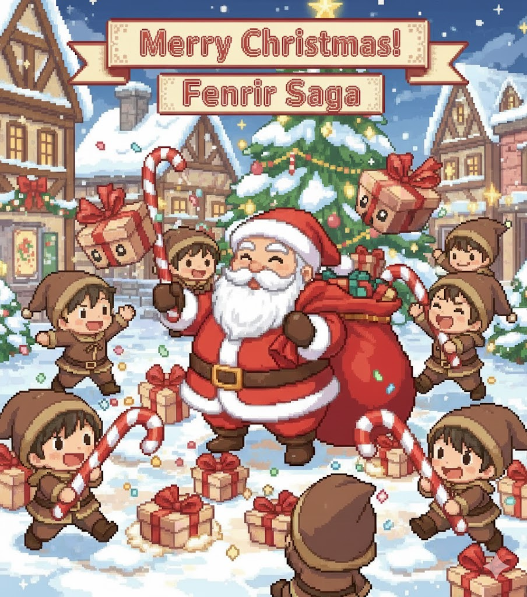

The magical season has arrived! We're thrilled to announce **Fenrir Saga's Christmas Event 2025** — a festive celebration featuring multiple holiday challenges!

Face the fearsome **Krampus** roaming the lands, battle exploding presents in the **Counterfeit Present Hunt**, or help the magical sisters in the **Karachun Ring Quest**! Earn **Event Tickets** to exchange for exclusive costumes and magical rewards!

<!-- more -->

## 🎄 Christmas Event Overview

This year's Christmas celebration features **four festive challenges** and **holiday monster spawns**:

1. **🎅 Antonio Invasion** — Santa's helper has appeared across the world
2. **👹 Krampus Hunt** — A roaming MVP boss challenge for all adventurers
3. **🎁 Counterfeit Present Hunt** — A team-based survival arena event
4. **💍 Karachun Ring Quest** — Help the three magical sisters

All events reward **Event Tickets** which can be exchanged for exclusive costumes and magical items!

---

## 🎅 Antonio Invades Midgard!

The spirit of Christmas has brought **Antonio**, Santa's mischievous helper, to nearly every corner of Rune Midgard! These jolly creatures appear in most maps across the world, bringing festive cheer and rewards to brave adventurers.

### 🎁 Antonio Spawns

Antonio appears in **over 100 maps** including:

- All Prontera, Geffen, Payon fields
- Rachel, Veins, and Lighthalzen areas
- Ice Dungeon, Thor's Volcano, and Abyss Lake
- Juperos, Juno fields, Hugel, and Umbala regions
- Many more dungeons and field maps!

**Spawn Rate**: 1 Antonio every 2-3 minutes per map

### 🎁 Drop Table

| Item | Notes |
|------|-------|
|  Various Gift Boxes | Standard Antonio drops |
|  Old Blue Box | Rare drop |

---

## 👹 Krampus — Roaming MVP Boss

The terrible **Krampus** stalks the lands of Rune Midgard, punishing the naughty and stealing presents! This horned demon MVP spawns every **3 hours** at random locations.

### 📊 Boss Stats

| Stat | Value |
|------|-------|
| **MVP** | Krampus |
| **Spawn Frequency** | Every 3 hours |
| **Race** | Demon |
| **Property** | Dark |

### 🏆 MVP Rewards (granted to player that deals killer blow)

| Reward | Amount | Notes |
|--------|--------|-------|
|  Event Ticket | 50 + (1-50 bonus) | Base reward plus random bonus |
|  Yggdrasil Berry | 2 | Guaranteed |

### 📍 How the Boss Spawning Works

Krampus can appear in one of **five festive locations**:

- **prt_fild08** — Southern fields of Prontera
- **pay_fild01** — Forest south of Payon
- **gef_fild07** — Rolling hills west of Geffen
- **gef_fild04** — Bridge north of Geffen
- **prt_fild06** — Eastern grasslands of Prontera

### 🔮 Riddle Hint System

Krampus doesn't reveal his location immediately! Players must decipher cryptic riddles:

!!! info "Riddle Timeline"
    - **Spawn**: First riddle hint is broadcast immediately
    - **After 2 minutes**: Second riddle hint appears
    - **After 4 minutes**: Final riddle hint

!!! example "Example Riddle Hints"
    - *"Where southern fields of Prontera sprawl, and adventurers gather at nature's call"*
    - *"Where forest paths wind south and deep, in Payon's shadow secrets keep"*
    - *"Where Geffen's bridge does northward span, crossing waters since time began"*

### 🌙 Atmospheric Effects

When Krampus spawns:

- The sky turns to **perpetual night**
- **No EXP penalty** on the boss map (safe to fight!)
- **Daylight returns** when the beast is defeated

### 🔥 The Yule Hearth

After Krampus is defeated, the **Yule Hearth's power is restored**! Visit **Santa's Elf** in **Prontera (147,196)** to warm yourself by the magical fire. This applies for the whole server.

#### Yule Hearth Buff Benefits

Warming yourself by the hearth grants **powerful 20-minute buffs**:

| Buff | Effect | Duration |
|------|--------|----------|
| ** Increase AGI Level 10** | +12 AGI and Movement Speed | 20 minutes |
| ** Blessing Level 10** | +10 STR, DEX & INT | 20 minutes |
| ** Angelus Level 10** | Soft Defense (from VIT) +50% | 20 minutes |

!!! warning "Yule Hearth Usage Limits"
    - You can only warm yourself **once per Krampus defeat**
    - The hearth remains dormant until the next Krampus is slain

---

## 🎁 Counterfeit Present Hunt — Team Arena Event

Krampus has stolen the real presents and replaced them with cheap exploding counterfeits! Destroy these dangerous fakes before they explode, but be careful — they fight back!

### ⏰ Event Schedule

The Counterfeit Present Hunt runs **every 3 hours** at:

**00:00, 03:00, 06:00, 09:00, 12:00, 15:00, 18:00, 21:00** (server time)

!!! info "Event Announcements"
    - **30 seconds before event begins** — Join the **Worried Elf** in **Prontera (165,197)**
    - **Event starts** — 30 seconds preparation time, then the hunt begins!

### 📌 How It Works

- **Duration**: 10 minutes maximum (or until all presents destroyed)
- **Map**: 1@eom (Special arena)
- **Team Mode**: Automatically enabled with 2+ players
- **Dynamic Spawns**: More players = more presents to destroy

#### Present Scaling

- **Base Spawns**: 5 Counterfeit Presents
- **Player Scaling**: +1 present per player
- **Additional Spawns**: Presents continuously spawn during the event

### 🎁 The Counterfeits

#### Standard Counterfeit Present (Myst Case)

- **HP**: 1 HP (one-hit destroy)
- **Warning**: Explodes when destroyed, dealing damage!
- **Explosion Chance**: 5% per second to start exploding
- **Explosion Timer**: 3 seconds warning before detonation
- **Kill Reward**: 1 point for your team

#### Golden Present (C4 Myst Case)

- **HP**: 20 HP
- **Spawn**: Every 60 seconds
- **Explosion Timer**: 20 seconds warning before detonation
- **Kill Reward**: 5 points for your team
- **Special**: Takes multiple hits to destroy

### 👹 Enemy Interference

**Sasquatch** (Krampus's minions) spawn every **20 seconds** to interfere with your hunt! They will attack players attempting to destroy the presents.

### 💪 Power-Up Buffs

Special buff presents spawn every **30 seconds**. Collect them for temporary advantages:

| Buff Type | Duration | Effect |
|-----------|----------|--------|
| **Speed Boost** | 10 seconds | Increased movement speed |
| **Attack Boost** | 10 seconds | Increased damage |
| **Defense Boost** | 10 seconds | Reduced damage taken |

!!! tip "Buff Collection"
    Walk within **2 cells** of a buff present to automatically collect it!

### 🏆 Team Mode

When 2 or more players join:

- Players are divided into **Red Team** and **Blue Team**
- Teams identified by colored headgear
- **Red Team**: Red cloth, special headgear
- **Blue Team**: Blue cloth, special headgear
- Team with most destroyed presents wins!

### 🎯 Rewards

| Result | Event Tickets |
|--------|---------------|
| **Solo Participation** | Based on presents destroyed |
| **Team Winner** | Bonus tickets for all team members |
| **Team Loser** | Participation tickets |

### 💀 Event Mechanics

!!! danger "What Happens When You Die?"
    - **Respawn** at the event map spawn point
    - **Cannot leave** the map during the event
    - **Event continues** until time expires or all presents destroyed

### 🎯 Getting Started

1. Visit the **Worried Elf** in **Prontera (165,197)**
2. Join the event before it starts
3. Get teleported to the arena
4. **Destroy presents and avoid explosions!**

---

## 💍 Karachun Ring Quest — The Three Sisters

Three magical sisters need your help preparing gifts for the holidays! Complete their quest to earn powerful **Christmas Rings** with special abilities.

### 🎭 The Sisters

#### Snower — Middle Sister (Prontera 156,174)

The middle sister coordinates the gift wrapping operation.

- Converts fancy gift boxes into standard gray boxes
- Provides information about his sisters

#### Sneewy — Younger Sister (Louyang 224,249)

The younger sister helps poor children.

**Quest Requirements:**

- Bring **4 Gray Gift Boxes** to Sneewy
- **Reward**:  **Silver Christmas Ring** (personalized with your name)

#### Snoowy — Elder Sister (Byalan Dungeon Floor 2: 133,160)

The elder sister helps marine folk.

**Quest Requirements:**

- Bring **3 Gray Gift Boxes** to Snoowy
- **Reward**:  **Gold Christmas Ring** (personalized with your name)

### ✨ Ring Powers

The Christmas Rings have magical powers that activate **only from December 8 to January 8** when worn with **Santa's Hat**!

#### Silver Christmas Ring Effects

| Condition | Skill Granted |
|-----------|---------------|
| Worn alone | Visual effect (Angel wings) |
| With Santa's Hat + No AL_TELEPORT | Grants **Teleport Level 1** |
| With Santa's Hat + Has AL_TELEPORT | Grants **Identify Level 1** |
| With Both Rings + Santa's Hat | Enhanced Teleport (Level 2) |

!!! warning "Unequip Penalty"
    Lose **40 HP** when unequipping the Silver Ring

#### Gold Christmas Ring Effects

| Condition | Skill Granted |
|-----------|---------------|
| Worn alone | Visual effect (Sphere) |
| With Santa's Hat + No AL_HEAL | Grants **Heal Level 1** |
| With Santa's Hat + Has AL_HEAL | Grants **Hiding Level 4** |
| With Both Rings + Santa's Hat | Enhanced Heal (Level 5) |

!!! warning "Unequip Penalty"
    Lose **30 SP** when unequipping the Gold Ring

#### Santa's Hat Enhancement

When wearing **both rings** with Santa's Hat:

- Special **rainbow effect** every minute
- Combined ring powers are enhanced
- Bonus stats: **+1 MDEF, +1 LUK**

### 🎁 Getting Gray Gift Boxes

Gray Gift Boxes can be obtained by:

- Converting fancy gift boxes (Gift Box 1-4) with Snower
- Defeating Antonio across Midgard
- Event rewards

---

## 🛒 Event Ticket Exchange Shop

Visit **Santa** in **Prontera (146,197)** to trade your hard-earned Event Tickets for exclusive rewards!

### 🎭 Costume Rewards

| Item | Ticket Cost |
|------|------------|
|  Santa Poring Hat | 1,000 tickets |
|  Mini Tree Hat | 1,000 tickets |
|  Polar Bear Cap | 1,000 tickets |

### 🎁 Consumable Items

| Item | Ticket Cost |
|------|------------|
|  White Potion | 1 ticket |
|  Blue Potion | 3 tickets |
|  Dead Branch | 4 tickets |
|  Mastela Fruit | 10 tickets |
|  Yggdrasil Seed | 15 tickets |
|  Honey Pancake | 30 tickets |
|  Yggdrasil Berry | 40 tickets |

### 📦 Mystery Boxes

| Item | Ticket Cost |
|------|------------|
|  Old Blue Box | 50 tickets |
|  Old Purple Box | 150 tickets |
|  Old Card Album | 2,000 tickets |

---

## ⏰ Event Duration & Schedule

### Krampus MVP
- **Spawn Frequency**: Every 3 hours
- **Duration**: Until defeated
- **Hints**: Progressive riddles every 2 minutes

### Counterfeit Present Hunt
- **Schedule**: Every 3 hours at 00:00, 03:00, 06:00, 09:00, 12:00, 15:00, 18:00, 21:00
- **Duration**: 10 minutes per session

### Karachun Ring Quest
- **Availability**: Throughout the event period
- **Ring Powers**: Active December 8 - January 8

### Antonio Spawns
- **Availability**: Continuous throughout event
- **Spawn Rate**: 1 per map every 2-3 minutes

---

## 📊 Event Quick Reference

| Feature | Krampus Hunt | Counterfeit Hunt | Ring Quest |
|---------|--------------|------------------|------------|
| **Who Can Join** | All players | All players | All players |
| **Frequency** | Every 3 hours | Every 3 hours | Anytime |
| **Duration** | Until defeated | 10 minutes | One-time quest |
| **Difficulty** | MVP boss | Team survival | Quest chain |
| **Max Tickets** | 50-100 per kill | Based on performance | No tickets (ring reward) |
| **Special Reward** | Yule Hearth buff | Team victory bonus | Magic Christmas Rings |

---

The magic of Christmas has descended upon Rune Midgard! Will you hunt the fearsome Krampus, destroy exploding presents, or help the magical sisters? The holiday spirit awaits, brave adventurer!

**Merry Christmas!** 🎄🎅✨
